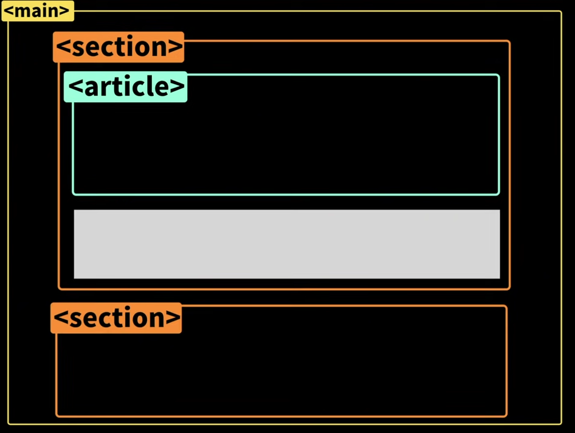

# ✅ HTML

- HTML은 **Hype Text Markup Language**의 약어로 마크업 구성에 가장 많이 사용되는 언어입니다.

## 💡 시멘틱 태그

- div처럼 의미가 없는 태그가 아닌, 상황에따라 쓰임새가 있는 태그
- 목적에 맞게 사용하면 SEO에 더 유리하게 만들 수 있고, 웹 접근성에도 좋습니다.
- div태그로만 구조를 짜는 것보다 알아보기 더 쉽기 때문에, 유지보수가 편하다는 장점이 있습니다.

### 1. \<h1> ~ \<h6>

- 각 세션에 제목을 나타내며 중요도에 따라 **h1 ~ h6**으로 나눠지며 **h1**이 가장 낮고, **h6**이 가장 높습니다.

### 2. \<header>

- 제목이나 대표 이미지가 들어가는 태그이며, **\<body>**의 하위로 성성되면 웹페이지의 전체 헤더로 사용되고, 전체 헤더로 사용 될 때는 주로 **\<nav>** 가 포함되어 있습니다.
  **\<section>** or **\<article>** 등의 하위에 사용되면 해당 영역의 헤더를 의미합니다. 일반적으로는 **\<h1>**, **\<h2>** 등의 태그나 로고등을 포함 합니다.

### 3. \<footer>

- **\<header>** 태그와 마찬가지로 전체 문서 or 해당 영역의 바닥글로 쓰입니다. **\<footer>** 에는 작성자나 관련 문서 링크, 라이선스, 색인 등의 데이터가 들어갑니다.

### 4. \<main>

- 페이지의 콘텐츠 영역을 의미합니다. **\<main>** 은 페이지당 한 번 사용하며 **\<body>** 아래 직접 추가하여 사용하고, 다른 태그 내에 사용하지 않아야 합니다.

### 5. \<article>

- 태그 자체가 하나의 의미 있는 콘텐츠 영역이며, 주로 단일 게시물을 나타낼때 사용합니다.

### 6. \<section>

- **\<article>** 과 유사하지만 페이지의 단일 부분을 그룹화 하는데 사용하는 태그입니다. **\<main>**, **\<article>** 안에 연관된 것들을 묶어 줄때 사용됩니다.

- 출처 : <a href="https://www.youtube.com/watch?v=T7h8O7dpJIg&t=455s" target="_blank">드림코딩 유트브</a>

### 7. \<aside>

- 페이지의 내용과 직접 관련이 없지만 간접적으로 관련된 추가 정보를 담는 태그입니다. **\<nav>** 요소나 광고, 인용처럼 분리된 콘텐츠를 나타날때 사용합니다.

### 8. \<nav>

- 주로 **\<header>** 태그안에 사용되며, 다른 페이지 또는 영역내의 특정 위치로 이동시키는 역할을 합니다.
