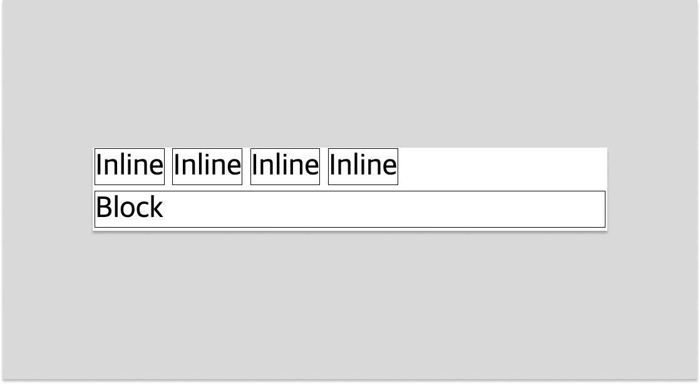
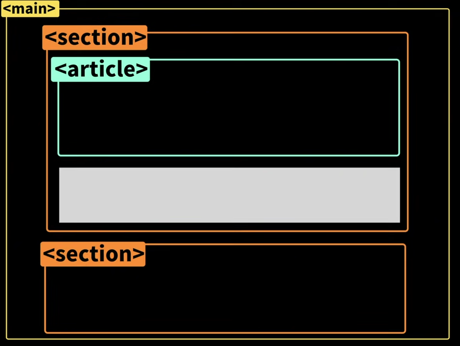
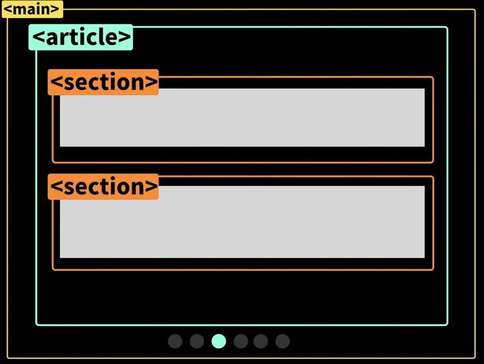

# ✅ HTML

- HTML은 **Hype Text Markup Language**로 마크업 구성에 가장 많이 사용되는 언어입니다.

## 💡 HTML의 기본적인 두가지 Display

### 1. 인라인(inline)

- 딱 태그의 필요한 공간만큼만 차지하는 Display속성입니다.
- 대표적인 태그로는 span, button, img 등이 있습니다.

### 2. 블럭(block)

- 필요한 공간만큼이 아닌 한줄의 전체를 차지하게 되는 Display의 속성입니다.
- 대표적으로는 div, form, article, main,section 등이 있습니다.



## 💡 시멘틱 태그

- div처럼 의미가 없는 태그가 아닌, 상황에따라 쓰임새가 있는 태그
- 목적에 맞게 사용하면 SEO에 더 유리하게 만들 수 있고, 웹 접근성에도 좋습니다.
- div태그로만 구조를 짜는 것보다 알아보기 더 쉽기 때문에, 유지보수가 편하다는 장점이 있습니다.

### 1. \<h1> ~ \<h6>

- 각 세션에 제목을 나타내며 중요도에 따라 **h1 ~ h6**으로 나눠지며 **h1**이 가장 낮고, **h6**이 가장 높습니다.

### 2. \<header>

- 제목이나 대표 이미지가 들어가는 태그이며, **\<body>**의 하위로 성성되면 웹페이지의 전체 헤더로 사용되고, 전체 헤더로 사용 될 때는 주로 **\<nav>** 가 포함되어 있습니다.
  **\<section>** or **\<article>** 등의 하위에 사용되면 해당 영역의 헤더를 의미합니다. 일반적으로는 **\<h1>**, **\<h2>** 등의 태그나 로고등을 포함 합니다.

### 3. \<footer>

- **\<header>** 태그와 마찬가지로 전체 문서 or 해당 영역의 바닥글로 쓰입니다. **\<footer>** 에는 작성자나 관련 문서 링크, 라이선스, 색인 등의 데이터가 들어갑니다.

### 4. \<main>

- 페이지의 콘텐츠 영역을 의미합니다. **\<main>** 은 페이지당 한 번 사용하며 **\<body>** 아래 직접 추가하여 사용하고, 다른 태그 내에 사용하지 않아야 합니다.

### 5. \<article>

- 태그 자체가 하나의 의미 있는 콘텐츠 영역이며, 주로 단일 게시물을 나타낼때 사용합니다.

### 6. \<section>

- **\<article>** 과 유사하지만 페이지의 단일 부분을 그룹화 하는데 사용하는 태그입니다. **\<main>**, **\<article>** 안에 연관된 것들을 묶어 줄때 사용됩니다.




- 출처 : <a href="https://www.youtube.com/watch?v=T7h8O7dpJIg&t=455s" target="_blank">드림코딩 유트브</a>

### 7. \<aside>

- 페이지의 내용과 직접 관련이 없지만 간접적으로 관련된 추가 정보를 담는 태그입니다. **\<nav>** 요소나 광고, 인용처럼 분리된 콘텐츠를 나타날때 사용합니다.

### 8. \<nav>

- 주로 **\<header>** 태그안에 사용되며, 다른 페이지 또는 영역내의 특정 위치로 이동시키는 역할을 합니다.

<br>
<br>
<br>
<br>

# ✅ CSS

- **Cascading Style Sheets**의 약자로 쉽게 설명하면 **HTML**의 태그를 꾸며주는 역할을 한다.

<br>

## 💡 작성 방법

> <br>기본적으로 html태그 안에서 **\<style>** 태그 안에 넣거나 css파일을 가져다 사용하는 방식을 사용합니다.
>
> ```
> <!DOCTYPE html>
> <html lang="en">
>   <head>
>    <meta charset="UTF-8" />
>    <meta http-equiv="X-UA-Compatible" content="IE=edge" />
>    <meta name="viewport" content="width=device-width, initial-scale=1.0" />
>    <title>Document</title>
>   <!-- 외부 css파일 연결하기 -->
>    <link rel="stylesheet" href="style.css">
>
>   <!-- 페이지 내부의 style태그 안에서 스타일 지정하기 -->
>    <style>
>   h1 {
>     font-size:14px;
>     }
>    <style/>
>  </head>
>  <body></body>
> </html>
> ```
>
> <br>

<br>

### 1. 가장 기본적인 css파일 또는 **\<style>** 태그 안에 사용할때

```

선택자 {
프로퍼티 : 값;
}
/_모든 h1태그의 font-size를 14px로 한다_/
h1 {
font-size:14px;
}

```

### 2. **HTML**의 태그에 직접적으로 사용할 때

```
<h1 style="font-size:14px;">제목입니다</h1>
```

## 💡 선택자

### 1. 전체 선택자 & Tag 선택자

- 모든 **HTML** 태그 또는 특정 **HTML**태그에 스타일을 적용 시킬때 사용한다.
- **HTML** 태그들은 기본적으로 가지고 있는 스타일 속성들이 있기 때문에 없애주기 위해 사용하기도 한다.

```
<!-- 모든 태그 선택자  모든 태그에 적용 -->
*{
  margin:0;
  padding:0;
}

<!-- 해당 태그 선택자 모든 li태그에 적용 -->
li{
  list-style:none;
}
```

<br>

### 2. Class 선택자

- 해당 **Class**를 가진 태그들에게만 스타일을 적용시킬 때 사용한다.
- 한번에 여러 **Class**를 사용할 수 있다.
- **.ClassName**로 태그를 선택한다

```
<!DOCTYPE html>
<html lang="en">
  <head>
    <meta charset="UTF-8" />
    <meta http-equiv="X-UA-Compatible" content="IE=edge" />
    <meta name="viewport" content="width=device-width, initial-scale=1.0" />
    <title>Document</title>
  </head>
  <body>
  <!-- 여러 Class를 사용할 경우에는 띄어쓰기로 구분한다 -->
    <h1 class="title bold">
      제목
    </h1>
  </body>
</html>

<!-- css -->

.title{
  font-size:14px;
}
.bold{
  font-weight:bold;
}

<!-- 이런식으로 두가지 Class를 다 가진 태그에만 적용 시킬 수도 있다. -->
.title.bold{
  font-size:28px;
}
```

<br>

### 3. Id 선택자

- 해당하는 **Id**를 가진 태그들에게만 스타일을 적용시킬 때 사용한다.
- **Id**는 **Class**와 반대로 여러 **Id**으을 적용 시킬 수 없다.
- **#IdName**로 태그를 선택한다.

```
<!DOCTYPE html>
<html lang="en">
  <head>
    <meta charset="UTF-8" />
    <meta http-equiv="X-UA-Compatible" content="IE=edge" />
    <meta name="viewport" content="width=device-width, initial-scale=1.0" />
    <title>Document</title>
  </head>
  <body>
    <h1 id="title">
      제목
    </h1>
    <!-- 아래와 같이 중복하여 사용할 수는 없다. -->
    <h1 id="title title2">
      제목2
    </h1>
  </body>
</html>

<!-- css -->

#title{
  font-size:14px;
}

```

<br>

### 4. 상속 선택

- 특정하는 태그, Class, Id안에 있는 자식요소를 선택할때 사용합니다.
- 띄어쓰기로는 안에 있는 모든 자식요소를 선택하며, >로는 바로 아래있는 자식요소를 선택합니다.

```
<!DOCTYPE html>
<html lang="en">
  <head>
    <meta charset="UTF-8" />
    <meta http-equiv="X-UA-Compatible" content="IE=edge" />
    <meta name="viewport" content="width=device-width, initial-scale=1.0" />
    <title>Document</title>
    <style>
    <!-- li 안에있는 모든 p들에게 적용 li>div>p 이런식으로 li안에있는 div안에있는 p에게도 적용 -->
      li p{
        font-weight:bold;
      }

    <!-- li바로 밑에 요소에게만 적용 li>p 인 요소에게만 적용  -->
      li>p{
        font-size:40px;
      }
    </style>
  </head>
  <body>
    <ul>
      <li>
        부모 요소
        <div>
          <p>자식요소의 자식요소</p>
        </div>
      </li>
      <li>
        부모요소
        <p>자식요소</p>
      </li>
    </ul>
  </body>
</html>

```

<br>

### 5. 다중 선택

- 한가지 스타일을 여러가지 태그나 **Class**, **Id**에 적용 시킬 때 사용한다.
- ,로 구분하여 사용한다.

```
  div, span, p, .title, #desc{
    font-size: 15px;
  }
```

### 더 많은 선택자들과 자세한 것을 알고 싶으면 옆의 링크로 이동! : <a href="https://www.w3schools.com/cssref/css_selectors.php" target="_black">w3schools</a>

<br>
<br>
<br>

## 💡 우선 순위와 명시도

- **style** 의 적용이 겹쳤을 경우 **css** 에서는 우선순위와 명시도에 따라 **style**을 적용시킨다.
- 기본적으로 **style**이 우선권은 **!important**>**Id**>**Class**>**TagName** 순으로 !important가 가장 높은 우선순위를 가진다.
- 가장 나중에 적용된 스타일이 적용된다.

<br>

### 1. 우선 순위

- 마지막에 적용된 스타일이 사용된다.
- 마찬가지로 **HTML** 에서 외부 **style** 파일을 가져올 때도 나중에 가져온 것이 적용된다.

```
<html lang="en">
  <head>
    <meta charset="UTF-8" />
    <meta http-equiv="X-UA-Compatible" content="IE=edge" />
    <meta name="viewport" content="width=device-width, initial-scale=1.0" />
    <title>Document</title>
    <!-- 나중에 가져온 style2가 우선순위로 적용된다. -->
    <link rel="stylesheet" href="style.css" />
    <link rel="stylesheet" href="style2.css" />
  </head>
  <body></body>
</html>

<!--  -->
h1{
  <!-- 마지막에 작성된 font-size-:20px;이 적용된다. -->
  font-size:30px;
  font-size:20px;
}
```

<br>

### 2. 명시도

- 정확하게 명시 한 태그가 적용됩니다.

```
<html lang="en">
  <head>
    <meta charset="UTF-8" />
    <meta http-equiv="X-UA-Compatible" content="IE=edge" />
    <meta name="viewport" content="width=device-width, initial-scale=1.0" />
    <title>Document</title>
    <style>
    <!-- h1.title이 태그네임과 className 두개다 정확히 명시해주었기 때문에 적도됩니다. -->
      h1.title{
        font-size:50px;
      }
      .title{
        font-size:30px;
      }
    </style>
  </head>
  <body>
    <h1 class="title">
      제목입니다.
    </h1>
  </body>
</html>
```

<br>

### 3. !important

- 든든 우선순위중 가장 높은 순위로 아래와 같이 사용합니다.

```
 h1.title{
  font-size:40px !important
 }
```
